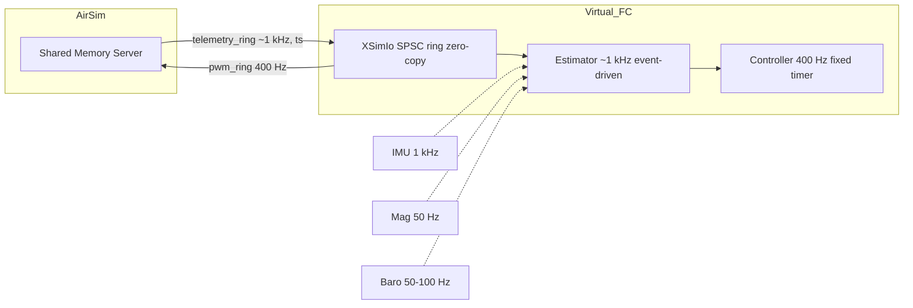

### XSim 시스템 개요

AirSim–xsim을 공유메모리 기반 IPC(XSimIo)로 연동해 고주파 폐루프를 구성했다. 텔레메트리는 ~1 kHz에서 타임스탬프 포함 lock‑free(SPSC 링버퍼)로 소비하고, PWM 명령은 400 Hz로 송신한다. 공유버퍼의 zero‑copy 경로와 Windows 고해상도 시계(steady_clock/QPC) 동기화를 통해 센서→제어 지연과 주기 지터를 낮췄다. 본 구현은 제어·추정 스레드 우선순위를 상승(High/AboveNormal)시켜 실시간성을 강화하였다.

주: SPSC lock‑free/zero‑copy 경로로 커널 경유 I/O와 복사를 회피하여 p95 지연·주기 지터를 감소시킨다.

