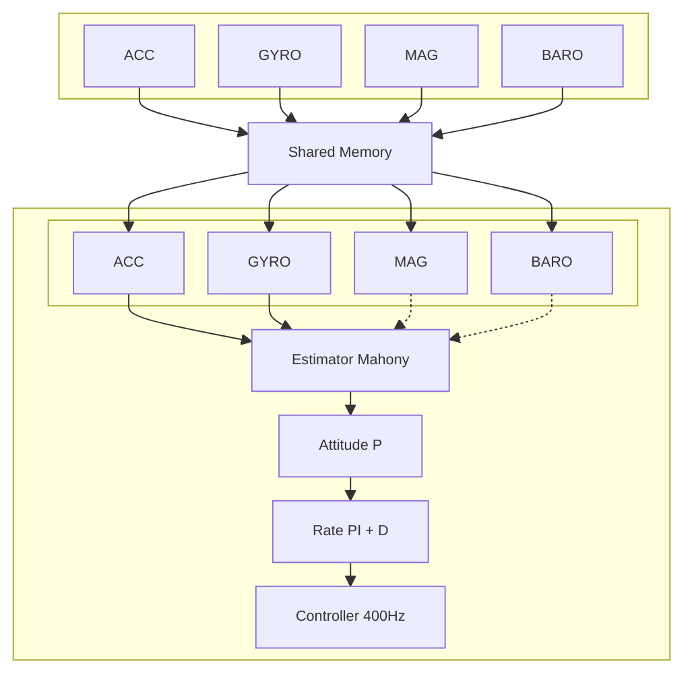

### XSim 시스템 개요

AirSim–xsim을 공유메모리 기반 IPC(XSimIo)로 연동해 고주파 폐루프를 구성했다. 텔레메트리는 ~1 kHz에서 타임스탬프 포함 lock‑free(SPSC 링버퍼)로 소비하고, PWM 명령은 400 Hz로 송신한다. 공유버퍼의 zero‑copy 경로와 Windows 고해상도 시계(steady_clock/QPC) 동기화를 통해 센서→제어 지연과 주기 지터를 낮췄다. 본 구현은 제어·추정 스레드 우선순위를 상승(High/AboveNormal)시켜 실시간성을 강화하였다.

주: SPSC lock‑free/zero‑copy 경로로 커널 경유 I/O와 복사를 회피하여 p95 지연·주기 지터를 감소시킨다.

### 상태추정기 — 마호니 + 적응형 게인

본 구현은 가속도계(ACC)와 자이로(GYRO)만을 사용하여 Mahony 계열 보정 항으로 쿼터니언 \(q=[w,x,y,z]^\top\)을 추정한다. 각 샘플의 타임스탬프로 가변 \(\Delta t\)를 계산하며, 매 스텝 \(q\)는 정규화한다.

- 가속도 신뢰도 게이팅(\(\|a\|\approx g\)일 때만 사용)과 보정 각속도, 쿼터니언 갱신

\[\hat{\mathbf a}=\frac{\mathbf a}{\|\mathbf a\|},\quad \mathbf g_{\mathrm{est}}=R(q)[0,0,-1]^\top,\quad \mathbf e=\mathbf g_{\mathrm{est}}\times\hat{\mathbf a}\]

\[\boldsymbol{\omega}_c=(\boldsymbol{\omega}-\mathbf b)+k_p\,\mathbf e+k_i\!\int\!\mathbf e\,dt,\qquad \dot q=\tfrac12\,q\otimes[0,\boldsymbol{\omega}_c],\qquad q\leftarrow\mathrm{normalize}\big(q+\dot q\,\Delta t\big)\]

- 게인 EMA 스무딩(시간상수 \(\tau\))

\[k_{\mathrm{cur}}\leftarrow k_{\mathrm{cur}}+\alpha\,(k_{\mathrm{cmd}}-k_{\mathrm{cur}}),\qquad \alpha=\mathrm{clip}\!\left(\frac{\Delta t}{\tau},\,0,\,\alpha_{\max}\right)\]

권장 값(본 구현 예): \(\tau\approx0.35\,\mathrm{s}\), \(\alpha_{\max}\approx0.25\).

- 자이로 바이어스 EMA(정지/저속 구간)

정적 근방 조건: \(\|\boldsymbol{\omega}\|<0.15\,\mathrm{rad/s}\), \(\big|\|\mathbf a\|-g\big|<1.0\,\mathrm{m/s^2}\)

\[\mathbf b\leftarrow(1-\beta)\,\mathbf b+\beta\,\boldsymbol{\omega},\qquad \beta=0.001\]

- 가속도 크기 기반 게인 스케줄 예시(EMA로 스무딩)

| 구간 | \(|\,\|a\|-g\,|\) | \((k_p,k_i)\) 수준 |
|---|---|---|
| 1g 근접 | < 0.3 | 높음 |
| 중간 | < 0.8 | 중간 |
| 동적 | ≥ 0.8 | 낮음 |

참고: Mahony 보정 항의 기본 형태는 Mahony et al., IEEE TAC 2008을 따른다.